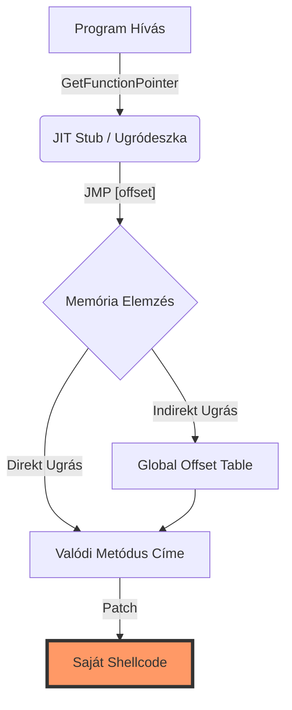

```mermaid
graph TD;
    A[Program Hívás] -->|GetFunctionPointer| B(JIT Stub / Ugródeszka);
    B -- JMP [offset] --> C{Memória Elemzés};
    C -->|Direkt Ugrás| D[Valódi Metódus Címe];
    C -->|Indirekt Ugrás| E[Global Offset Table];
    E --> D;
    D -->|Patch| F[Saját Shellcode];
    style F fill:#f96,stroke:#333,stroke-width:4px
```